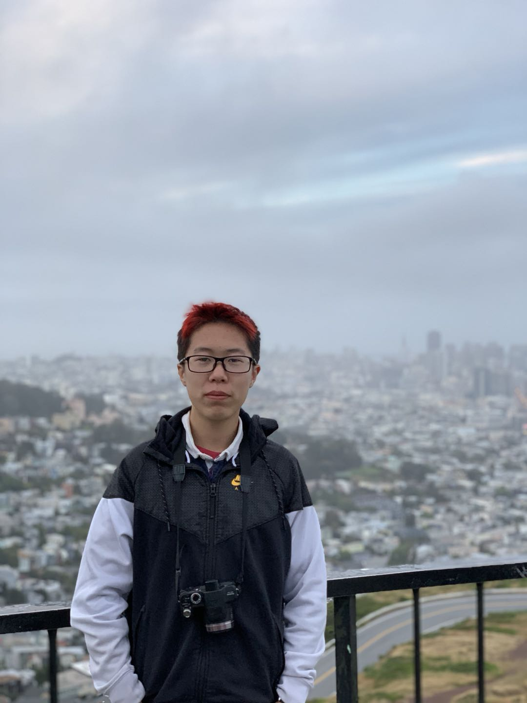

# CSE 110 Student Tianyue Zhao
### Me
Hi, I Tianyue Zhao. I CSE 110 student. Unfortunately I not so good at programming. 

**My languages `C++`, `Python`, `Java`.**

See person in the picture? Is me.


### My programming
As I said, I not so good at programming.
However, I happily show you how to hello world.
```
#include <iostream>
using namespace std;

int main()
{
    cout << "Hello World";
    return 0;
}
```
- [x] Include iostream
- [x] Declare namespace being used
- [x] Declare main function
- [x] cout to output statement
- [x] return 0 for successful run
See? Simple.

### Something about me
I no like Los Angeles so much, but I much like little Armenia community in Los Angeles.

Why I like little Armenia?
- Great Atmosphere
- Items good
- Items cheap
- Kebab so good
- Hear all sorts of languages

What should man do at little Armenia?
1. Kebab
2. Walk around community
3. Go to Jons marketplace
4. buy buy buy
5. Kebab
6. Go away

As wise man say,
> If item good and cheap, place good!

Want learn more about little Armenia? Learn all about [little Armenia!](https://www.google.com/url?sa=t&rct=j&q=&esrc=s&source=web&cd=&cad=rja&uact=8&ved=2ahUKEwjhw-2nvJnzAhXQpJ4KHXrOCRAQFnoECAkQAQ&url=https%3A%2F%2Fen.wikipedia.org%2Fwiki%2FLittle_Armenia%2C_Los_Angeles&usg=AOvVaw0f5daitdHbWuPp2BBkeU_L)